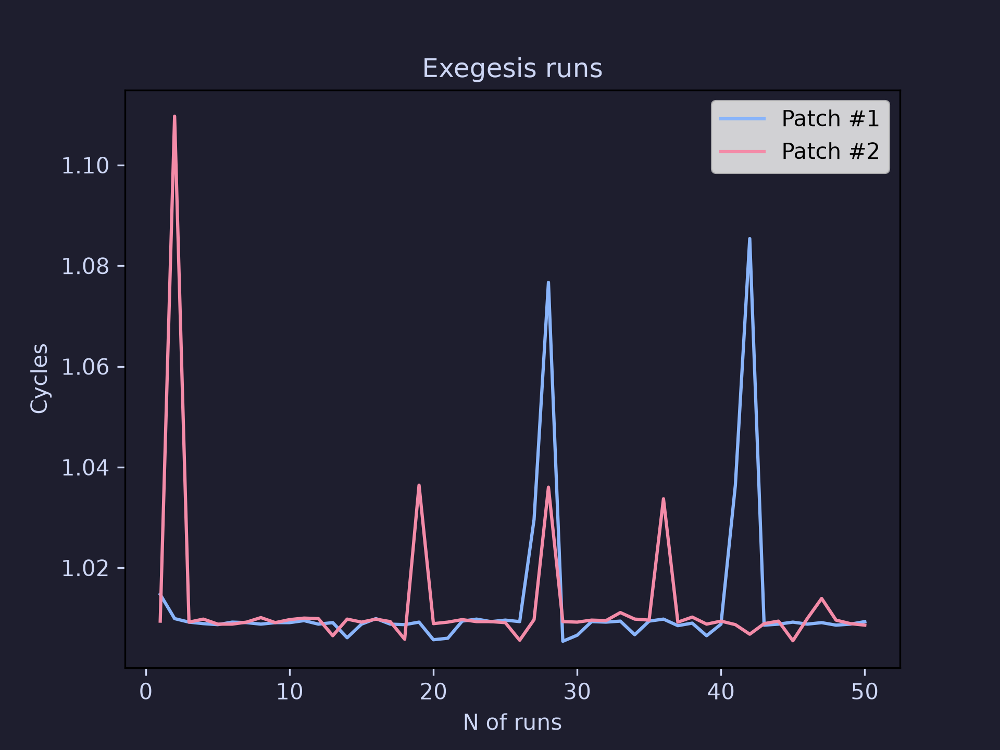

# BenchWire 

Bash + Python automation harness for [`llvm-exegesis`](https://llvm.org/docs/CommandGuide/llvm-exegesis.html).
Runs single or A/B comparison benchmarks, computes statistics, and plots
the result.



<details>
<summary>Example statistical output</summary>

Latency | Mode - compare

A. Patch #1 B. Patch #2

Methodology - random interleaving | 50 Runs | Cooldown time - 50ms

Mean | A: 1.0127 B: 1.0127
Mean Difference: 0.0085% (Patch #2 higher)

Median | A: 1.0091 B: 1.0093
Median Difference: 0.0248% (Patch #2 higher)

Standard Deviation | A: 0.0148 B: 0.0152
StdDev Difference: 2.6157% (Patch #2 higher)

Coefficient of Variation | A: 1.4664% B: 1.5051%
CoV Difference: 2.6072% (Patch #2 higher)

Min | A: 1.0054 B: 1.0055

Max | A: 1.0854 B: 1.1097

Percentile statistics

P50  | A: 1.0091  B: 1.0093

P75  | A: 1.0094  B: 1.0098

P90  | A: 1.0104  B: 1.0114

P99  | A: 1.0811  B: 1.0738

P99.9| A: 1.0850 B: 1.1061

</details>

### Why?

Currently there are no other LLVM Exegesis automation harnesses. This
project looks to allow seamless automation for benchmarking with Exegesis,
and eventually beyond it.

## What it does

- Runs `llvm-exegesis` N times in single mode, or runs two configurations
head to head in compare mode.

- Compare mode supports three run orderings (sequential, cycling, random
interleaving) specifically to control for time-based bias like thermal
drift and frequency scaling skewing numbers, see [`docs/methodology.md`](docs/methodology.md)
for why this matters.

- Produces a Catppuccin-themed plot and a markdown stats summary
(mean, median, stddev, CoV, percentiles up to P99.9) for every run.

## Requirements

- `llvm-exegesis` built with libpfm4 support
- bash
- Python 3 with the packages in `requirements.txt`

## Quick Start

```bash
git clone https://github.com/MaximPotapchik/BenchWire
cd BenchWire
chmod +x bench.sh
pip install -r requirements.txt
cp .env.example .env
```

Edit `.env` with your binary path(s), opcode, and mode, then run:

```bash
./bench.sh --mode single
./bench.sh --mode compare
```

You'll be asked to pick option 1 (use `.env`) or option 2 (enter flags at
the prompt). Option 2 is sequential-only and doesn't take labels yet,
see [`docs/known-issues.md`](docs/known-issues.md).

Every run wipes `results/yaml/` first, so don't point `ALLOWED_DELETE_DIR`
anywhere sensitive if this is forked. Results land in `results/yaml/` (raw
exegesis output per run) and `results/plots/` (a plot + a markdown stats
summary, timestamped). 

## Comparison methodology

Set via `METHODOLOGY=` in `.env`:

- `sequential` (default) | all A runs, then all B runs
- `cycling` | A, B, A, B, etc.
- `random interleaving` | shuffled order, same N runs each

Full reasoning in [`docs/methodology.md`](docs/methodology.md). Short
version: naive back-to-back comparison lets anything that drifts over
time (thermal state, frequency scaling, whatever else is on the box) get
absorbed entirely into whichever side ran second.

## Docs

- [`docs/methodology.md`](docs/methodology.md) | why run ordering matters.
- [`docs/known-issues.md`](docs/known-issues.md) | current gaps and rough edges.
- [`docs/roadmap.md`](docs/roadmap.md) | what's planned but not built yet.

## Roadmap

Actively extending this beyond a single-box benchmark runner: optional
InfluxDB export (with git-SHA tagging), additional command utilities, and
run progress/ETA instead of a wall of identical "run complete" lines. Details
and reasoning in [`docs/roadmap.md`](docs/roadmap.md).

## Contributing

Still a solo project shaping its own direction, not asking for broad
review yet, but real help is genuinely welcome. `docs/known-issues.md`
is the honest list of what's actually broken right now, start there.

Compiler/LLVM background is especially useful for anything touching
exegesis internals or PMU quirks across vendors. A background in said 
area is not necessary. Open an issue before a nontrivial PR.

## License

MIT, see [`LICENSE`](LICENSE).
