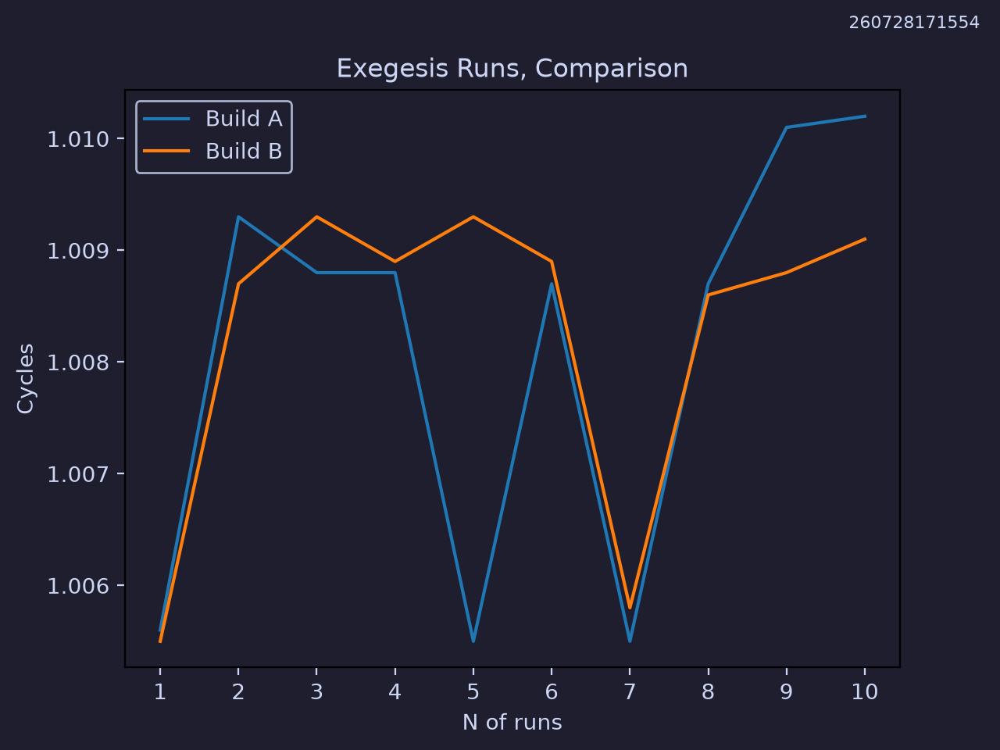

# BenchWire 

This is an automation harness currently used for [`llvm-exegesis`](https://llvm.org/docs/CommandGuide/llvm-exegesis.html).
It runs single or A/B comparison benchmarks automatically, computes statistics,
and plots the result. The goal is to have a modular framework capable of
targetting any benchmarker, with continuous integration in mind.



<details>
<summary>Example statistical output</summary>

**Methodology:** random interleaving

**Runs:** 20

**CPU:** znver2

**Triple:** x86_64-unknown-linux-gnu

**Min instructions:** 10000

### Summary Statistics

| Metric | Build A | Build B | Diff |
|---|---|---|---|
| Mean | 1.0107 | 1.0093 | 0.13% (Build A) |
| Median | 1.0091 | 1.0093 | 0.02% (Build B) |
| Standard Deviation | 0.0108 | 0.0037 | 98.09% (Build A) |
| Variance | 1.1742e-04 | 1.3725e-05 | 158.14% (Build A) |
| Coefficient of Variation | 1.07% | 0.37% | 97.99% (Build A) |
| Range | 0.0779 | 0.0277 | 95.08% (Build A) |
| IQR | 0.0008 | 0.0005 | 43.14% (Build A) |
| Min | 1.0055 | 1.0053 | 0.02% (Build A) |
| Max | 1.0834 | 1.0330 | 4.76% (Build A) |

### Percentile Statistics

| Percentile | Build A | Build B | Diff |
|---|---|---|---|
| P50 | 1.0091 | 1.0093 | 0.02% (Build B) |
| P75 | 1.0094 | 1.0094 | 0.00% (Build A) |
| P90 | 1.0098 | 1.0098 | 0.00% (Build A) |
| P99 | 1.0541 | 1.0236 | 2.93% (Build A) |
| P99.9 | 1.0805 | 1.0321 | 4.58% (Build A) |
| P99.99 | 1.0831 | 1.0329 | 4.74% (Build A) |

</details>

### Why?

Currently there are no other LLVM Exegesis automation harnesses in open source.
This project looks to allow seamless automation for benchmarking with Exegesis,
and eventually beyond it.

## What it does

1. Runs `llvm-exegesis` N times in single mode, or runs two configurations
head to head in compare mode. This is done automatically after selecting 1 or 2
after running the command.

2. Compare mode supports three run orderings (sequential, cycling, random
interleaving) specifically to control for time-based bias like thermal
drift and frequency scaling skewing numbers, see [`docs/methodology.md`](docs/methodology.md)
for why this matters.

3. Parses the outputs and automatically performs statistical analysis
with the outputs of the target benchmarker.

4. Produces a Catppuccin-themed plot and a markdown stats summary
(mean, median, stddev, CoV, percentiles up to P99.99 + more) for every run.

## Requirements

- `llvm-exegesis` and its dependencies. 
- Bash
- Python 3

## Quick Start

```bash
git clone https://github.com/MaximPotapchik/BenchWire
cd BenchWire
chmod +x setup.sh
./setup.sh
```

For the full list of `config.yaml` settings, see [`docs/commands.md`](docs/commands.md).

This will run the setup script, creating the `config.yaml` and populating it with
`config.example.yaml`.
Edit `config.yaml` with your binary path(s), along with your desired 
llvm-exegesis flags, then run:

```bash
./benchwire
```

You'll be asked to pick option 1 (use `config.yaml`) or option 2 (enter flags
at the prompt). Option 2 is currently disabled via Go. For more information, 
see [`docs/known-issues.md`](docs/known-issues.md).

Currently, this only supports `--mode=latency`. Support for further modes is
being being built.

Results land in `results/yaml/` (raw exegesis output per run) and 
`results/plots/` (a plot + a markdown stats summary, timestamped). 

## Comparison methodology

Set via `methodology:` in `config.yaml`:

- `single` | Runs a single binary.
- `sequential` (default) | All A runs, then all B runs.
- `cycling` | A, B, A, B, etc.
- `random interleaving` | Shuffled order, same N runs each.

Full reasoning in [`docs/methodology.md`](docs/methodology.md). Short
version: naive back-to-back comparison lets anything that drifts over
time (thermal state, frequency scaling, whatever else is on the box) get
absorbed entirely into whichever side ran second.

## Docs

- [`docs/commands.md`](docs/commands.md) | All of the commands currently available.
- [`docs/methodology.md`](docs/methodology.md) | Why run ordering matters.
- [`docs/known-issues.md`](docs/known-issues.md) | Current gaps and rough edges.
- [`docs/roadmap.md`](docs/roadmap.md) | What's planned but not built yet.

## Roadmap

Actively extending this beyond a single-box benchmark runner: optional
InfluxDB export (with git-SHA tagging), additional configuration utilities, and
run progress/ETA instead of a wall of identical "run complete" lines. Details
and reasoning in [`docs/roadmap.md`](docs/roadmap.md).

## In progress

Currently being upgraded in capabilities regarding full support for 
`llvm-exegesis` modes.

## Contributing

Still a solo project shaping its own direction, not asking for broad
review yet, but real help is genuinely welcome. `docs/known-issues.md`
is the honest list of what's actually broken right now, start there.

Compiler/LLVM background is especially useful for anything touching
exegesis internals or PMU quirks across vendors. A background in said 
area is not necessary. Open an issue before a nontrivial PR.

## License

MIT, see [`LICENSE`](LICENSE).
